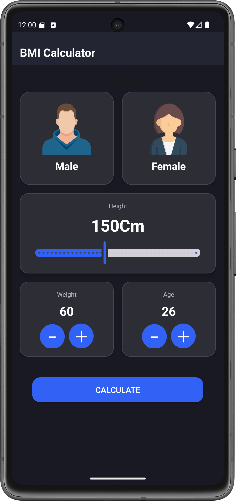
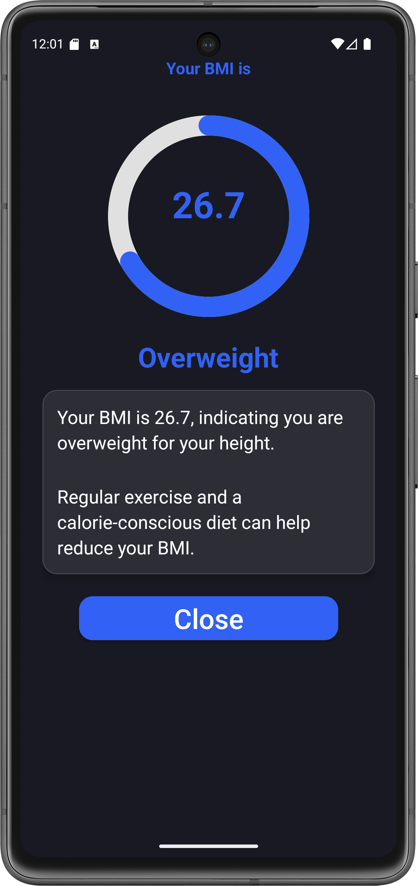

# BMI Calculator App 🚀

A modern and responsive **BMI Calculator Android app** built using Material Design.  
It calculates your Body Mass Index based on **height**, **weight**, **age**, and **gender**, then categorizes the result with a personalized message and health tip.

---

## 📸 Screenshots

| Home | Result |
|------|--------|
|  |  |

---

## ⚙️ Features

- 🧮 Instant BMI calculation
- 🎨 Clean MaterialCardView UI
- 📊 Circular progress indicator
- 👦 Gender selection using custom cards
- 🎛️ Height slider (Material Slider)
- ➖➕ Buttons for Age and Weight control
- 🌙 Light & Cyberpunk-ready themes

---

## 💡 BMI Categories

| BMI Range       | Category      |
|------------------|---------------|
| Under 18.5       | Underweight   |
| 18.5 – 24.9      | Normal        |
| 25.0 – 29.9      | Overweight    |
| 30.0 and above   | Obese         |

> The app shows a result message like:  
> 🟦 “Your BMI is 21.7, indicating you are in the **Normal** range for adults of your height.”

---

## 📦 Installation

### Requirements
- Android Studio Bumblebee or newer
- Android SDK 30+
- Internet permission (if using Firebase or analytics)

### Run it
```bash
git clone https://github.com/bhaveshpro33/BmiApp
cd BMIApp
